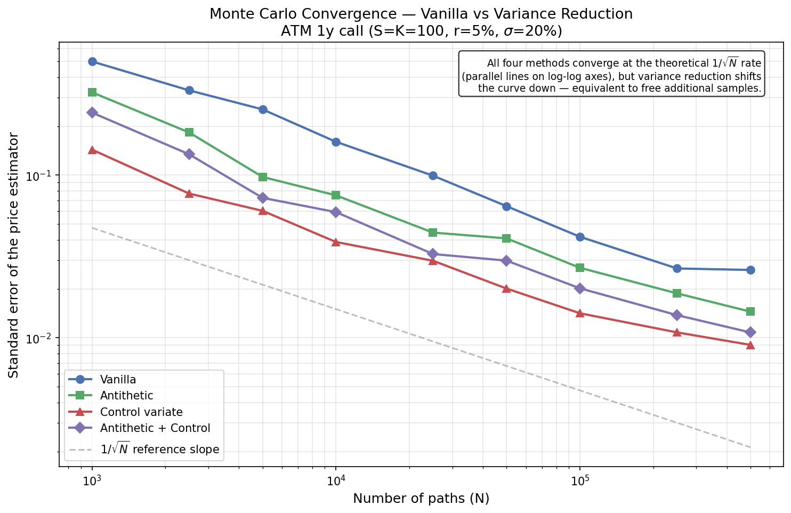
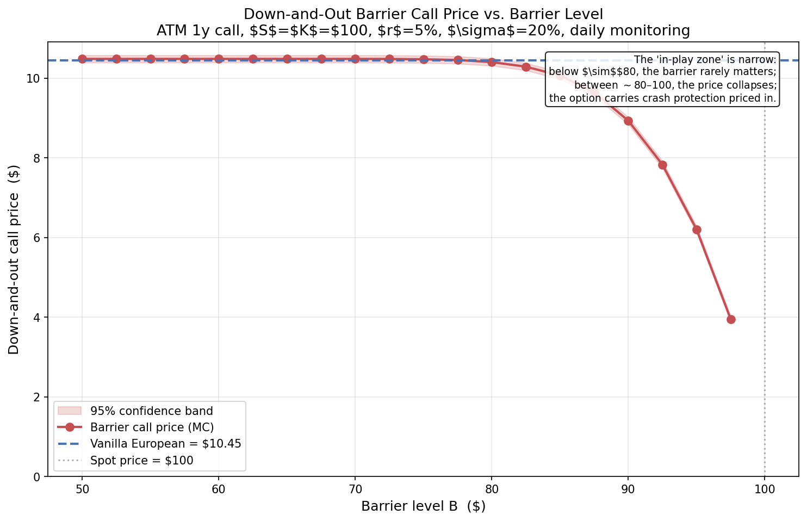

# Monte Carlo Options Pricer with Variance Reduction and Exotic Payoffs

A Monte Carlo pricing framework for European, Asian, and barrier options under risk-neutral Geometric Brownian Motion. Built as the second project in a quantitative finance portfolio. Validates against an independent closed-form Black-Scholes implementation, demonstrates antithetic and control variate variance reduction, and prices exotic options that have no closed-form solution.

## Highlights

- **Risk-neutral GBM simulation** of terminal prices and full paths, vectorized in NumPy
- **Cross-validation against Black-Scholes**: vanilla MC prices agree with closed-form BS within a few standard errors across moneyness and maturities
- **Variance reduction techniques**: antithetic variates (~50% variance reduction) and control variates (~85% variance reduction) with the discounted terminal price as a natural control
- **Exotic option pricers**: arithmetic Asian (no closed form) and down-and-out barrier (fragile closed forms in practice) — both validated via limit cases
- **13 passing tests** including BS agreement, variance reduction bounds, exotic limit cases, and structural monotonicity

---

## Convergence — Variance Reduction in Action



Empirical standard error of each estimator as a function of the number of paths N, on log-log axes. All four methods follow the theoretical `1/√N` decay (parallel slopes), but variance reduction shifts the curves downward — equivalent to "free" additional samples. The control variate alone gives ~85% variance reduction on an ATM 1-year call, roughly equivalent to running with 7× more paths.

A subtle and important observation: **combining antithetic and control variates is worse than the control variate alone.** The techniques aren't independent — antithetic pre-reduces variance, leaving less for the control variate to work on. The right strategy for vanilla European options is control variate alone.

---

## Barrier Option Price Discovery



Price of a down-and-out barrier call as a function of the barrier level B. The curve has the characteristic shape of barrier products: **flat at vanilla price for B far below spot, then collapsing rapidly as B approaches spot.** The "in-play zone" — where the barrier meaningfully affects the price — is narrow, here roughly $80 to $100. Below $80, the barrier is so unlikely to be hit (in a 1-year ATM call with 20% vol) that the option prices identically to vanilla. Above $90, the option becomes substantially cheaper as knock-out probability rises.

This shape is real market knowledge: it explains why barrier products often quote at small discounts to vanilla and why the discount steepens nonlinearly near the spot.

---

## The math

### Risk-neutral pricing

For any derivative with payoff `H` at time T:

```
V_0 = exp(-rT) * E^Q[H]
```

where Q is the risk-neutral measure. Every pricing technique in this project — closed-form BS, vanilla MC, exotic MC — is a different way to compute this single expectation.

### GBM simulation

Under Q, the stock follows `dS = rS dt + σS dW`. The exact solution at time T:

```
S_T = S_0 * exp[(r - σ²/2) * T + σ * sqrt(T) * Z],   Z ~ N(0, 1)
```

For path-dependent payoffs (Asian, barrier), we simulate the full path step-by-step using the same exact GBM solution applied to small time steps:

```
S_{t+dt} = S_t * exp[(r - σ²/2) * dt + σ * sqrt(dt) * Z_t]
```

GBM is one of the rare SDEs with a closed-form solution at every time, so this stepping introduces no discretization error.

### Variance reduction

**Antithetic variates**: for each random Z, also use -Z. Pair-averaged estimator has variance `Var(Y)/2 · (1 + ρ)` where ρ is the correlation between Y(Z) and Y(-Z). For monotone payoffs like vanilla calls/puts, ρ is negative → real variance reduction. **Crucially, the correct standard error must be computed from pair-averages, not raw samples — assuming independence between N antithetic samples is a common mistake that hides the variance reduction.**

**Control variates**: use a correlated random variable X with known mean μ_X. The controlled estimator:

```
Y^CV = Y - β·(X - μ_X)
```

is unbiased for any β, but variance is minimized at `β* = Cov(X, Y) / Var(X)` — the OLS regression slope of Y on X. The minimized variance is `Var(Y)·(1 - ρ²)`. For an ATM call, using `X = e^(-rT)·S_T` (whose mean under Q is `S_0` by the martingale property) gives ρ ≈ 0.95, so variance drops ~90%.

### Exotic payoffs

**Asian (arithmetic-average) call**:
```
payoff = max( mean(S_{t_1}, ..., S_{t_n}) - K, 0 )
```
No closed form because the sum of correlated lognormals isn't lognormal.

**Down-and-out barrier call**:
```
payoff = max(S_T - K, 0)   if min_{t ∈ [0,T]} S_t > B
       = 0                  otherwise
```
Continuous-monitoring closed form exists (Reiner-Rubinstein) but is fragile under discrete monitoring, dividends, or stochastic vol.

---

## What I learned

**The variance-reduction stacking problem.** My initial implementation showed antithetic + control variate giving worse variance than control alone (28% vs 15% of vanilla variance). This isn't a bug — the techniques aren't additive. Antithetic pre-reduces variance by exploiting `Corr(Y(Z), Y(-Z)) < 0`; the control variate then has a smoother input and less to remove. For vanilla European options, control variate alone is the right call. This kind of nonlinear interaction between variance reduction techniques is one of the genuinely subtle pieces of Monte Carlo practice.

**The standard error trap with antithetic.** A naive `std(Y) / sqrt(N)` formula treats N antithetic samples as independent and misses the variance reduction entirely. The correct SE comes from `std(Y_pairs) / sqrt(N/2)` over the pair-averages. This is the kind of subtle numerical-statistics issue that real production code gets wrong and real review processes catch.

**Limit-case validation is the unsung hero of exotic pricing.** With no closed form for Asian or arithmetic-average options, the path-simulation logic could be silently wrong. The fix: design the code so that the Asian pricer at `n_steps=1` reduces exactly to a vanilla European, and verify the two match to machine precision with the same RNG seed. Same for barriers with `B ≪ S_0`. This pattern — collapse to a known case, verify exact agreement — is how production exotic pricers get validated.

---

## Project structure

```
mc-pricer/
├── black_scholes.py         # Imported from Project 1 — closed-form pricer used for validation
├── monte_carlo.py           # European MC pricer with variance reduction (Days 1-2)
├── exotics.py               # Asian and barrier option pricers (Day 3)
├── plot_mc_convergence.py   # Generates mc_convergence.png
├── plot_barrier_curve.py    # Generates barrier_price_curve.png
├── test_monte_carlo.py      # 13 tests
├── mc_convergence.png       # Variance reduction visualization
├── barrier_price_curve.png  # Barrier price discovery visualization
├── requirements.txt
└── README.md
```

## Running it

```bash
pip install -r requirements.txt

# Vanilla MC + variance reduction comparison
python3 monte_carlo.py

# Exotic options with limit-case sanity checks
python3 exotics.py

# Generate the convergence plot
python3 plot_mc_convergence.py

# Generate the barrier curve plot
python3 plot_barrier_curve.py

# Full test suite
pytest -v
```

## API examples

```python
from black_scholes import BlackScholesInputs, OptionType
from monte_carlo import price_european_mc
from exotics import price_asian_call, price_barrier_down_out_call

inputs = BlackScholesInputs(S=100, K=100, T=1.0, r=0.05, sigma=0.20)

# Vanilla European with all variance reduction techniques
result = price_european_mc(
    inputs, OptionType.CALL,
    n_paths=100_000,
    antithetic=True,
    control_variate=True,
    seed=42,
)
print(result)  # MCResult(antithetic + control, price=10.46, SE=0.025, ...)

# Arithmetic Asian call with daily monitoring
asian = price_asian_call(inputs, n_paths=100_000, n_steps=252, seed=42)

# Down-and-out barrier with B=85
barrier = price_barrier_down_out_call(
    inputs, barrier=85, n_paths=100_000, n_steps=252, seed=42,
)
```

---

## Tests

13 tests across four categories:

| Category | What's verified |
|---|---|
| Convergence to Black-Scholes | Vanilla MC agrees with closed-form BS within 4 SEs across 5 parameter sets (calls, puts, ITM, OTM, short/long T) |
| Variance reduction | Antithetic and control variates each reduce variance by ≥20% and ≥50% respectively; estimators remain unbiased |
| Exotic limit cases | Asian at n_steps=1 matches vanilla MC exactly; barrier at B=1 matches vanilla within sampling error; invalid inputs raise |
| Structural properties | Asian (daily) is cheaper than vanilla; barrier price is monotonically non-increasing in B |

---

## Limitations and future work

1. **No path dependence in variance reduction.** The variance reduction implementation works on European payoffs. For Asians, the natural control variate is the geometric-average Asian (Kemna-Vorst), which has a closed form and >99% correlation with the arithmetic version — implementable as a small extension.

2. **GBM only.** Heston (stochastic vol), Merton jump-diffusion, and local volatility models all use the same MC framework with modified step-update equations. The variance reduction techniques mostly carry over.

3. **Single-asset.** Multi-asset / basket options would require Cholesky decomposition of correlated Brownian motions; not implemented.

4. **No American exercise.** Longstaff-Schwartz least-squares MC handles American options within this framework — a natural extension.

5. **Discrete monitoring bias.** The barrier pricer uses discrete daily monitoring (n_steps=252). For continuous monitoring, this slightly *overprices* the option (continuous monitoring is more likely to hit the barrier). The Broadie-Glasserman-Kou correction handles this in production.

6. **Risk-neutral simulation only.** Pricing under Q answers "what's it worth"; risk-management questions also need real-world (P) simulation. Not implemented.

---

## References

- Boyle, P. (1977). "Options: A Monte Carlo Approach," *Journal of Financial Economics*, 4(3). — the founding paper of Monte Carlo in finance.
- Glasserman, P. *Monte Carlo Methods in Financial Engineering* (2003) — the definitive reference.
- Kemna, A. & Vorst, A. (1990). "A Pricing Method for Options Based on Average Asset Values," *Journal of Banking and Finance*, 14. — closed form for geometric Asian.
- Broadie, M., Glasserman, P., Kou, S. (1997). "A Continuity Correction for Discrete Barrier Options," *Mathematical Finance*. — handles discrete vs continuous monitoring.
- Hull, J. *Options, Futures, and Other Derivatives*, 9th ed. — Chapters 21, 25.

---

Part of a broader quantitative finance project portfolio. Project 1 (closed-form Black-Scholes + Greeks + IV solver): [bsm-pricer](https://github.com/Dev2943/bsm-pricer). Next: factor models or risk analytics.
